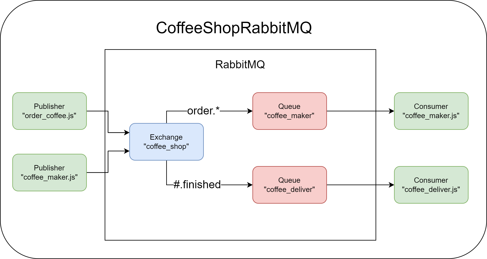

# CoffeShopRabbitMQ

## Run RabbitMQ locally in docker container
`docker run -d -it --rm -p 5672:5672 -p 15672:15672 rabbitmq:3-management`
### Access interface of RabbitMQ in `[localhost:15672](http://localhost:15672/)`

## Run coffe-maker and coffe-deliver in Bash:
`./coffee-maker.js`
`./coffee-deliver.js`

## Create coffee order
`./order-coffee.js "coffee_name" "client_name"`

Example: `./order-coffee.js "expresso" "Guilherme"`

## Architecture

## Based on https://www.rabbitmq.com/tutorials/tutorial-five-javascript.html